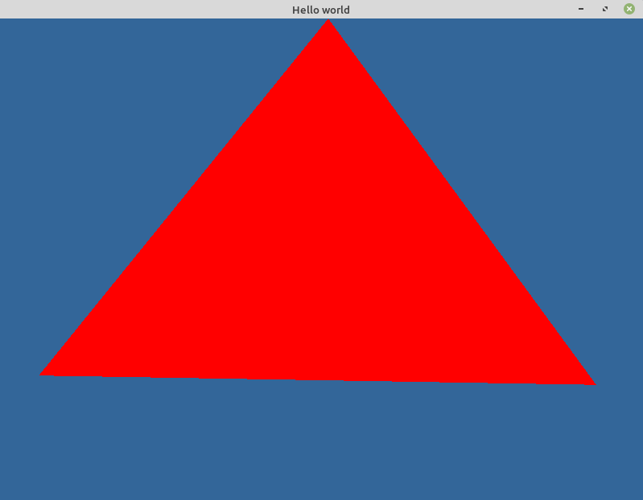

# Learning ZIGLANG and OpenGL with Xlib

This project is a very simple *quick & dirty* bit of code to learn the above.

- How to create a window using Xlib on linux.
- How to set up an opengl context in that window using GLX
- how to use zig

It is certainly not intended to be an example of how to write high
quality code, there is little error checking and everything is in
*main*.

## To build and run
`$ zig build`  
`$ ./zig-out/bin/main`

## Notes
For reference, this was built using zig verion `0.10.0-dev.108+7c1e17a84` on Linux Mint 
`"Linux Mint 20.2 Uma"`